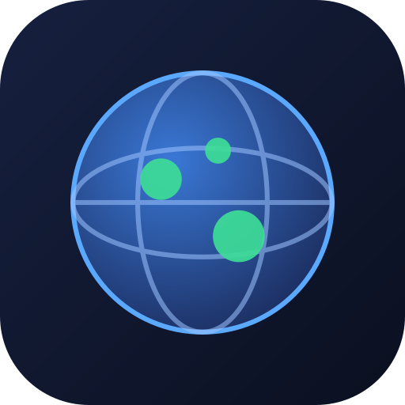

<div align="center">



&nbsp;

&nbsp;


**Track the countries you've visited and want to go — with facts, live safety advisories, and real-time flights.**

[Features](#-features) • [Live Demo](#-live-demo) • [Quick Start](#-quick-start) • [Development](#-development)

</div>

---

## 🌟 Features

- 🌍 **Interactive 3D globe and flat map** — switch between a WebGL globe (Three.js + react-globe.gl) and a pannable, zoomable Mercator SVG flat map; both rendered from the same country data
- ✈ **Live flight tracking** — real aircraft positions from adsb.lol overlay both views with heading, speed, altitude, route line, and aircraft photos from Planespotters
- 🛡 **Official travel safety advisories** — US State Department levels (1–4) bundled as an offline snapshot, supplemented by live US + Canada feeds; colour-coded risk meter on hover
- 📖 **Rich country detail panel** — capital marker, region, population, languages, currencies, area, and a Wikipedia extract fetched in your chosen language
- 📝 **Personal travel journal** — mark countries as visited, wishlist, or blocked; log visit dates with a month picker; star-rate them; record what you loved and what to skip
- 💾 **Privacy-first, offline-capable** — all data lives in `localStorage` (never sent anywhere); export/import or copy/paste JSON to back up or migrate across devices; PWA-ready with a service worker
- 🌐 **Multilingual UI** — full translations in English, French, Spanish, and German with automatic locale detection and north/south-up compass toggle

## 🔗 Live Demo

**[globetrotter-map.vercel.app](https://globetrotter-map.vercel.app)**

## 🚀 Quick Start

```bash
git clone https://github.com/kud/globetrotter.git
cd globetrotter
npm install
npm run dev
```

Open [http://localhost:3000](http://localhost:3000). Click any country on the globe or flat map to see facts, set a status, and start building your personal atlas.

## 🔧 Development

### Project tree

```
src/
├── app/
│   ├── api/          # Route handlers: advisories, flight, plane-info, plane-photo
│   ├── layout.tsx    # Root layout — fonts, theme flash prevention, PWA register
│   ├── manifest.ts   # Web App Manifest for PWA install
│   └── page.tsx      # Entry point: <Sidebar> + <MapStage>
├── components/
│   ├── globe-view.tsx    # WebGL 3D globe (react-globe.gl + Three.js)
│   ├── flat-map.tsx      # D3-zoom SVG Mercator map
│   ├── map-stage.tsx     # Toolbar: view toggle, spin, language, theme, compass
│   ├── sidebar.tsx       # Stats, search, country list, save/export
│   ├── country-panel.tsx # Slide-in detail panel with journal fields
│   └── flight-panel.tsx  # Slide-in live flight details + aircraft photo
├── lib/
│   ├── store.ts          # Zustand store (persisted to localStorage)
│   ├── advisory.ts       # Offline US State Dept advisory data
│   ├── advisory-store.ts # Live advisory fetch (US RSS + Canada)
│   ├── flight.ts         # adsb.lol poller + hexdb route lookup
│   ├── geo.ts            # TopoJSON → GeoJSON country features
│   ├── country-info.ts   # Country metadata + capital coordinates
│   ├── colors.ts         # Theme-aware colour palette
│   ├── i18n.ts           # Translations (en / fr / es / de)
│   └── save-file.ts      # JSON export / import / clipboard helpers
└── data/
    ├── advisories.json   # Bundled US State Dept advisory snapshot
    ├── capitals.json     # Capital city lat/lng index
    └── country-info.json # Country metadata (flags, region, population…)
```

### Scripts

| Command         | Description                          |
| --------------- | ------------------------------------ |
| `npm run dev`   | Start the Next.js development server |
| `npm run build` | Production build                     |
| `npm run start` | Serve the production build locally   |
| `npm run lint`  | Run ESLint across the codebase       |

## 🏗 Tech Stack

| Library                                                        | Role                                              |
| -------------------------------------------------------------- | ------------------------------------------------- |
| [Next.js 16](https://nextjs.org)                               | React framework, App Router, API routes           |
| [React 19](https://react.dev)                                  | UI layer                                          |
| [Three.js 0.184](https://threejs.org)                          | WebGL renderer for the globe                      |
| [react-globe.gl](https://github.com/vasturiano/react-globe.gl) | Globe primitives: polygons, points, HTML elements |
| [D3 (geo / zoom / selection / transition)](https://d3js.org)   | Flat map projection, pan/zoom behaviour           |
| [topojson-client](https://github.com/topojson/topojson-client) | TopoJSON → GeoJSON conversion for country borders |
| [world-atlas](https://github.com/topojson/world-atlas)         | Bundled 110m TopoJSON world topology              |
| [Zustand 5](https://zustand-demo.pmnd.rs)                      | Client state with `localStorage` persistence      |
| [Framer Motion](https://www.framer-motion.com)                 | Slide-in panel animations                         |
| [Tailwind CSS v4](https://tailwindcss.com)                     | Utility-first styling                             |
| [TypeScript 5](https://www.typescriptlang.org)                 | Type safety across the entire codebase            |

---

MIT © [kud](https://github.com/kud) — Made with ❤️
